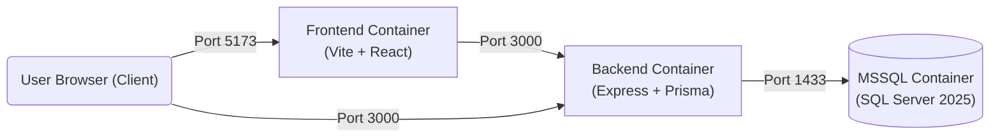

# 🏢 kon-cloud

[](https://nodejs.org/)
[](https://react.dev/)
[](https://www.typescriptlang.org/)
[](https://www.prisma.io/)
[](https://www.microsoft.com/en-us/sql-server)
[](https://www.docker.com/)
[](LICENSE)

**kon-cloud** is a containerized full-stack web application designed for condominium management. It uses a React SPA frontend, an Express REST backend with Prisma ORM, Microsoft SQL Server, and a full container deployment via Docker Compose.

## Features

- **Authentication and Security**:
    - JWT Access with Refresh Token Rotation with HttpOnly cookies.
    - Double-Submit Cookie CSRF protection via `csrf-csrf`.
    - Rate limiting on API routes and auth endpoints via `express-rate-limit`.
- **Condominium and Administrator Management**:
    - Administrator account handling with password hashing (`bcrypt`).
- **Modern Frontend**:
    - Built with React, TypeScript, and Vite.
    - Powered by [Chakra UI v3](https://www.chakra-ui.com/) components with dark mode support.
    - Dynamic routing with React Router and Axios request/auth interceptors.
- **Containerized Microservices**:
    - Fully containerized micro-architecture (MSSQL Server, Node.js backend, static frontend web server via `serve`).
    - Automated database migrations and ORM client generation on container boot.
    - Shared TypeScript interfaces package ensuring type safety across frontend and backend.

## Architecture



## Repository Structure

This project follows a monorepo structure.

```
kon-cloud/
├── backend/                  # Express REST API application
│   ├── prisma/               # Prisma schema and migrations
│   ├── src/                  # Routes, middleware, and utilities
│   ├── tests/                # Jest integration & unit tests
│   ├── Dockerfile            # Container definition for backend service
│   └── package.json
├── database/                 # MSSQL docker env files
├── frontend/                 # React SPA application
│   ├── src/                  # Pages, components, hooks, and API clients
│   ├── Dockerfile            # Multi-stage container build for frontend
│   └── package.json
├── interfaces/               # Shared TypeScript interfaces and DTOs
├── docker-compose.yml        # Orchestration for MSSQL, Backend, and Frontend
├── LICENSE                   # Project license (MIT)
└── README.md                 # Project documentation
```

## Prerequisites

Ensure you have the following installed on your machine:

- [Docker](https://docs.docker.com/get-docker/) and [Docker Compose](https://docs.docker.com/compose/)
- [Node.js](https://nodejs.org/), _optional, required for local non-Docker development_
- [npm](https://www.npmjs.com/), _optional, required for local non-Docker development_

## 🚀 Getting Started

### 1. Using Docker Compose (Recommended)

The easiest way to start all services (MSSQL database, Backend API, and Frontend application) is using Docker Compose.

1. **Clone the repository:**

    ```bash
    git clone https://github.com/AlfredoJSpera/kon-cloud.git
    cd kon-cloud
    ```

2. **Configure environment variables:**
   Copy the `.env.example` files to `.env` in the respective subdirectories and configure them:

    ```bash
    cp backend/.env.example backend/.env
    cp frontend/.env.example frontend/.env
    cp database/.env.example database/.env
    ```

3. **Launch all services:**

    ```bash
    docker compose up --build -d
    ```

4. **Verify the services:**
    - **Frontend App**: http://localhost:5173
    - **Backend REST API**: http://localhost:3000
    - **MSSQL Server**: localhost:1433

5. **Stop services:**
    ```bash
    docker compose down
    ```

### 2. Manual Local Development

If you prefer running services directly on your host machine for development:

#### A. Database (MSSQL)

Start only the MSSQL container:

```bash
docker compose up mssql -d
```

#### B. Backend Setup

```bash
cd backend
cp .env.example .env

# Install dependencies
npm install

# Run database migrations & generate Prisma client
npm run db:deploy

# Start backend in hot-reload dev mode
npm run dev
```

The backend API will run at http://localhost:3000.

#### C. Frontend Setup

In a new terminal:

```bash
cd frontend
cp .env.example .env

# Install dependencies
npm install

# Start Vite development server
npm run dev
```

The frontend application will run at http://localhost:5173.

## Environment Configuration

### Backend (`backend/.env`)

| Variable               | Description                               | Default                 |
| :--------------------- | :---------------------------------------- | :---------------------- |
| `DB_HOST`              | Database host name / container service    | `mssql`                 |
| `DB_PORT`              | MSSQL port                                | `1433`                  |
| `DB_NAME`              | Database name                             | `kon`                   |
| `DB_USER`              | Database user                             | `sa`                    |
| `DB_PASSWORD`          | Database password                         | `YourPassword123`       |
| `SV_PORT`              | Backend server port                       | `3000`                  |
| `ACCESS_TOKEN_SECRET`  | Secret key for signing JWT access tokens  | String                  |
| `REFRESH_TOKEN_SECRET` | Secret key for signing JWT refresh tokens | String                  |
| `CSRF_TOKEN_SECRET`    | Secret key for double-submit cookie CSRF  | String                  |
| `FRONTEND_URL`         | Allowed CORS origin for the frontend      | `http://localhost:5173` |

### Frontend (`frontend/.env`)

| Variable           | Description                                  | Default                 |
| :----------------- | :------------------------------------------- | :---------------------- |
| `VITE_BACKEND_URL` | URL of the backend API accessible by browser | `http://localhost:3000` |

### Database (`database/.env`)

| Variable            | Description                                    | Default           |
| :------------------ | :--------------------------------------------- | :---------------- |
| `MSSQL_SA_PASSWORD` | System Administrator password for MSSQL Server | `YourPassword123` |

## Database Management

The project uses **Prisma ORM** with Microsoft SQL Server.

### Common Database Commands (from `backend/`)

- **Apply existing migrations & generate client**:

    ```bash
    npm run db:deploy
    ```

- **Create a new migration after updating `schema.prisma`**:

    ```bash
    npx prisma migrate dev --name migration_name
    ```

- **Regenerate Prisma Client**:

    ```bash
    npx prisma generate
    ```

- **Open Prisma Studio (DB UI viewer)**:
    ```bash
    npx prisma studio
    ```

## Testing & Quality Assurance

### Backend Tests

The backend contains unit and integration tests written with **Jest** and **Supertest**:

```bash
cd backend

# Run all tests
npm test

# Run tests in watch mode
npm run test:watch
```

### Frontend Linting & Type Checking

```bash
cd frontend

# Run ESLint check
npm run lint

# Build and verify TypeScript types
npm run build
```

## API Overview

The backend exposes RESTful API endpoints under `/api`:

### Authentication (`/auth`)

- `POST /auth/register` — Register a new administrator account.
- `POST /auth/login` — Authenticate administrator and receive session token.
- `POST /auth/refresh` — Refresh access token via HTTP-only refresh cookie.
- `POST /auth/logout` — Revoke active session tokens.

### Administrator & Condominium Management (`/administrators`)

- `GET /administrators/me` — Get current logged-in administrator profile.
- `GET /administrators/me/condominiums` — List condominiums managed by administrator.
- `POST /administrators/me/condominiums` — Add a new condominium under management.

## License

Distributed under the MIT License. See [`LICENSE`](LICENSE) for more details.

---

<p align="center">
  Developed for the <strong>Cloud Computing</strong> course at <strong>Università degli Studi di Salerno (UNISA)</strong>, A.A 2025/26.
</p>
