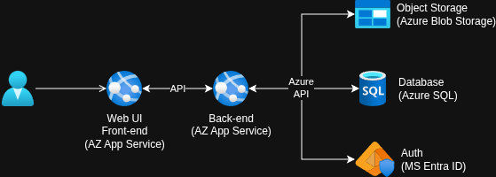

# Proposta di progetto

## Abstract

Un'applicazione web-based multi-account dedicata alla gestione condominiale. Il software si rivolge agli Amministratori di Condominio, offrendo loro una piattaforma per gestire molteplici condomini, come l'anagrafica degli inquilini e la supervisione dell'intera contabilità (spese ordinarie e straordinarie, riscossioni, generazione ricevute, ...).

## Lista servizi Azure utilizzati

- Azure Ape Service: Per l'hosting della Web UI Front-end e del Back-end API.
- Azure SQL Database: Storage relazionale principale del sistema per mantenere dati strutturati.
- Azure Blob Storage: Storage per conservare fatture (PDF o immagini) collegate alle spese condominiali.
- Microsoft Entra ID: Gestisce l'identità, l'autenticazione e il controllo degli accessi.

## Architettura del progetto

L'architettura del sistema segue un modello a livelli, orientato ai servizi cloud.

- Livello di Presentazione (Front-end): L'utente interagisce con una Web UI responsive ospitata su Azure App Service.
- Livello di Logica Applicativa (Back-end API): Il Front-end comunica tramite un API con il servizio di Back-end, anch'esso ospitato su Azure App Service. Esegue le operazioni richieste sui dati.
- Livello di Dati: Il Back-end comunica con i servizi di Azure per l'autenticazione (Entra ID) e per la persistenza di dati strutturati (SQL DB) e non (Blob Storage).

## Vantaggi dell'ambiente Cloud

- Scalabilità delle risorse IT in base al traffico effettivo, riducendo i costi nei periodi di inattività.
- L'uso del Blob Storage permette di disaccoppiare gli allegati dai dati normali, in modo da non sovraccaricare il database relazionale.
- Sfruttando l'integrazione nativa tra Entra ID e le regole di accesso del database relazionale, si ottiene un forte isolamento dei dati tra gli account, in modo che un amministratore non abbia fisicamente modo di accedere ai dati di un altro amministratore.
